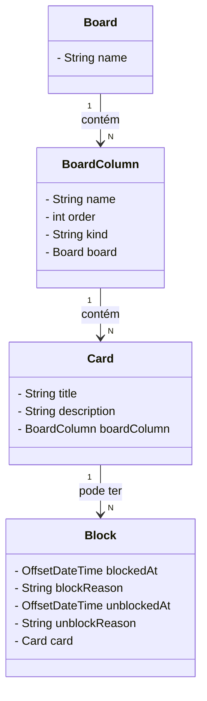

# Board para gerenciamento de tarefas
Sistema de gerenciamento de boards para organização de tarefas via linha de comando.
O sistema permite criar, selecionar e excluir boards, armazenando todas as informações em um banco de dados PostgreSQL.
Cada board é composto por colunas que seguem uma ordem específica e possuem um tipo definido (inicial, pendente, final ou cancelamento).
Os cards podem ser criados, movidos entre colunas seguindo a ordem definida, bloqueados e desbloqueados mediante justificativa, e cancelados a qualquer momento, exceto na coluna final.
Cards bloqueados não podem ser movidos até serem desbloqueados.
O menu do sistema oferece funcionalidades para visualizar os boards, criar e gerenciar cards, garantindo a integridade das regras definidas para a movimentação dos cards dentro de cada board.

## Descrição do projeto/desafio
O projeto é praticamente igual ao feito nas [aulas](https://github.com/digitalinnovationone/board), com algumas modificações e melhorias.

### Requisitos
- [x] 1 - O código deve iniciar disponibilizando um menu com as seguintes opções: Criar novo board, Selecionar board, Excluir boards, Sair;
- [x] 2 - O código deve salvar o board com suas informações no banco de dados MySQL;

### Regras dos boards
- [x] 1 - Um board deve ter um nome e ser composto por pelo menos 3 colunas ( coluna onde o card é colocado inicialmente, coluna para cards com tarefas concluídas e coluna para cards cancelados, a nomenclatura das colunas é de escolha livre);
- [x] 2 - As colunas tem seu respectivo nome, ordem que aparece no board e seu tipo (Inicial, cancelamento, final e pendente);
- [x] 3 - Cada board só pode ter 1 coluna do tipo inicial, cancelamento e final, colunas do tipo pendente podem ter quantas forem necessárias, obrigatoriamente a coluna inicial deve ser a primeira coluna do board, a final deve ser a penúltima e a de cancelamento deve ser a última
- [x] 4 - As colunas podem ter 0 ou N cards, cada card tem o seu título, descrição, data de criação e se está bloqueado;
- [x] 5 - Um card deve navegar nas colunas seguindo a ordem delas no board, sem pular nenhuma etapa, exceto pela coluna de cards cancelados que pode receber cards diretamente de qualquer coluna que não for a coluna final;
- [x] 6 - Se um card estiver marcado como bloqueado ele não pode ser movido até ser desbloqueado
- [x] 7 - Para bloquear um card deve-se informar o motivo de seu bloqueio e para desbloquea-lo deve-se também informar o motivo

### Menu de manipulação de board selecionado
O menu deve permitir:
- [x] Criar um card
- [x] Mover o card para próxima coluna
- [x] Bloquear um card
- [x] Desbloquear um card
- [x] Cancelar um card
- [x] Ver colunas e cards
- [x] Fechar board

### Requisitos opcionais
- [ ] 1 - Um card deve armazenar a data e hora em que foi colocado em uma coluna e a data e hora que foi movido pra a próxima coluna;
- [ ] 2 - O código deve gerar um relatório do board selecionado com o tempo que cada tarefa demorou para ser concluída com informações do tempo que levou em cada coluna
- [ ] 3 - O código dever gerar um relatório do board selecionado com o os bloqueios dos cards, com o tempo que ficaram bloqueados e com a justificativa dos bloqueios e desbloqueios.

## Diagrama de classes

## Instalação
Após clonar e importar o repositório:
1. Configure o banco de dados:
  - Para facilitar, use o banco de dados PostgreSQL e crie um banco de dados chamado "board" sem tabelas.
  - Caso queira usar outro, terá que alterar as migrations, queries e a [conexão](https://github.com/wastecoder/spring-cli-board/blob/main/src/main/java/com/br/board/persistence/config/ConnectionConfig.java).
  - Além disso, terá que colocar a dependência do banco escolhido no pom.xml.
2. Execute o arquivo __BoardApplication__ e use o menu.
